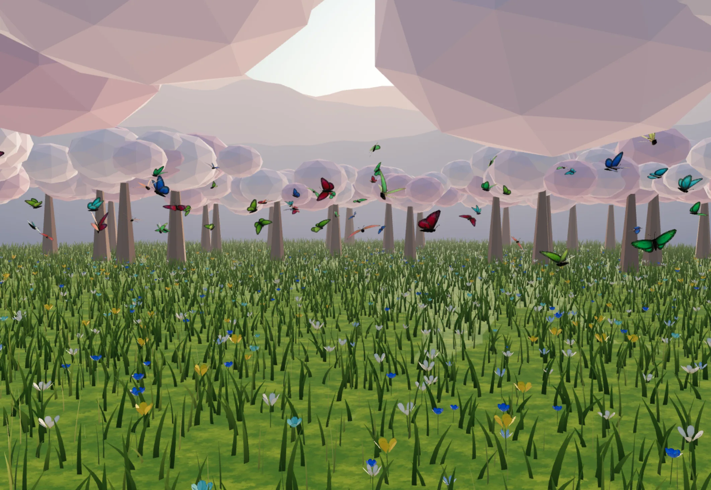

<div align="center">

# 🦋 Butterfly Garden

**Let one butterfly go. It flies the meadow for seven days, then the wind takes it.**

A living sakura meadow that runs in a browser — and a small, quiet web app
built on top of it. Release a butterfly, name it, watch it fly, and lose it on
schedule.

[**→ butterfly-garden-khaki.vercel.app**](https://butterfly-garden-khaki.vercel.app)

[](https://nextjs.org)
[](https://threejs.org)
[](https://www.postgresql.org)
[](LICENSE)




</div>

---

## The idea

The meadow holds **200 butterflies** and no more. Sixty of them are residents —
they were always there and they never leave. The remaining 140 slots belong to
visitors: butterflies that people released.

A released butterfly lives **seven days**. It gets a name, two wing colours and
a seed that decides its size, its wingbeat and which edge of the meadow it
entered from. On the seventh day it fades out of the scene, its colour is
deleted from the database, and only a name and a date remain in its owner's
history.

Nothing here is real-time. The meadow is a quiet place: another tab's butterfly
does not appear in yours, and that is deliberate. The only thing the page
notices on its own is a life running out.

---

## Two worlds, one repository

| | What | How it runs |
|---|---|---|
| **The app** | `app/` + `components/` — Next.js, the real product | `npm run dev` |
| **The scene engine** | `src/` — plain JavaScript three.js that has never heard of React | imported by the app |

The engine was deliberately **not** converted to TypeScript. It works, it is
documented, and it is imported as-is through `allowJs`. The bridge between the
two worlds is four functions wide — `release`, `remove`, `clearVisitors`,
`indexOf` — so that React components can never reach in and start juggling
instance indices.

> The source comments and internal docs are in Turkish. The product itself is
> in English.

---

## How it works

### One page. No routes.

Apart from the four legal pages, the site has no routing at all. The meadow is
never unmounted — only the card floating above it changes. Navigation is a
state machine plus a history stack inside `components/Garden.tsx`; the browser's
own history is not used, because changing the address would tear the scene down
and rebuild it.

Sign-in follows the same rule: authentication returns **typed responses**, not
redirects. There are exactly two exceptions, and both are doors rather than
screens — `/auth/confirm` (email links) and `/auth/google/callback`. They set a
cookie and drop you back on the meadow.

### The whole swarm is two draw calls

Bodies and eyes collapse into one merged geometry, the four wings into another,
and both are drawn as `InstancedMesh`. Agent state lives in flat
`Float32Array`s rather than objects — hundreds of agents each allocating a few
vectors per frame meant tens of thousands of short-lived objects per second.

### Wing flapping lives in the vertex shader

An instance matrix can carry position, orientation and scale — but not a wing
angle. So every vertex knows which wing it belongs to, and every instance
carries its own phase and speed.

The stroke is deliberately **not** a sine wave: the downstroke takes 42% of the
cycle and the upstroke 58%. Make it symmetric and the whole swarm picks up a
mechanical windscreen-wiper feel.

The maths exists twice on purpose — as pure JavaScript in `butterfly/flap.js`
and as its direct GLSL counterpart in `swarm/wingShader.js`. They change
together or not at all.

### The wing pattern is a texture, not vertex colour

Branching veins with a discal cell, directional scale texture, a submarginal
band, separated lunules, a fringe, eyespots, and a normal map generated from
the veins — all painted into one atlas. Keeping the pattern in the texture is
what lets detail and triangle count move independently: richer wings cost atlas
memory and about 70 ms of generation time, not a single extra vertex.

### Slots are permits, not addresses

Guests get 20 slots and members get 120, but those are not two regions of
memory. Every butterfly sits in **one contiguous block**, because
`Swarm.update()` only walks `[0, count)` — a gap would be a butterfly that is
drawn but never flies. When one leaves, the last one is moved into the hole,
carrying its full state: position, velocity, heading, wingbeat phase, raw
random draws. Copy only the colour and it would teleport on the next frame.

Indices are therefore never stored, only asked for. The follow camera resolves
a butterfly's position from its **id** every single frame.

### Appearance comes from the seed, not the slot

Slots are recycled, so a butterfly that inherited its slot's size would look
different after every refresh. On release the swarm re-seeds the slot from the
butterfly's own seed, and its entry point into the meadow comes from the same
generator. Same butterfly, same size, same edge — forever.

### Seven days is two instants, never a duration

The engine does not know what "seven days" means. It receives `releasedAt` and
`expiresAt` as absolute moments and draws the ratio between them. The number
lives in exactly one place (`lib/types.ts`), so the rule can change without the
meadow quietly fading on the old schedule.

The fade itself is **dithered discard**, not transparency. A transparent
butterfly would need sorted drawing, and `InstancedMesh` does not sort its
instances — the wings would erase each other at random.

### The follow camera carries, it does not lock

When you follow a butterfly, the orbit's centre is moved onto it while you keep
full control of angle and zoom. It works by re-deriving the offset from the
camera's own position every frame and shifting target and camera by the **same
vector**, so the orbit angles never drift. There is no hard lock: every wingbeat
would land on screen as a jolt.

### Identity is ours

No third-party auth service. Plain Postgres, argon2id hashes, and sessions that
are **opaque tokens rather than JWTs** — the database stores a SHA-256 digest of
the token. That choice buys one thing: revocability. "Deleting your account ends
every session" is a promise you cannot keep with a signed token; you keep it by
deleting rows.

Google sign-in was written the same way — the authorization-code flow with PKCE,
two route handlers and one `fetch`, no library. It asks for `openid email` and
nothing else: your meadow name and colour are yours to choose, not Google's to
provide.

A few things follow from taking security seriously in a small app:

- Password verification runs **even when the account does not exist**, against a
  dummy hash. Skip it and the response gets measurably faster — and that timing
  difference answers the question "is this email registered?"
- Sign-in has exactly one error message. Which field was wrong is never
  revealed, and the error outline falls on **both** inputs, because colour must
  not say what the words refuse to.
- Password reset ends every session that was open at the time.
- The browser never talks to the database. Not one environment variable is
  `NEXT_PUBLIC_`, which is also why the session cookie can stay `httpOnly`.

### Portable on purpose

The hosting decision was deferred until launch, so nothing in the code belongs
to a provider. The database is plain `pg` and a connection string — Neon,
Supabase's Postgres, a local install, all the same. Mail is generic SMTP behind
a single function. Migrations run with `npm run migrate` and don't need `psql`.

Swapping either one is an environment variable, not a refactor.

---

## Performance

| Butterflies | CPU / frame | Triangles | Draw calls |
|--:|--:|--:|--:|
| 120 | 0.95 ms | 152 K | 2 |
| 500 | 1.29 ms | 635 K | 2 |
| 800 | 2.41 ms | 1.02 M | 2 |

Against a 16.7 ms budget, at roughly 1600 vertices per butterfly. Quality steps
down on small screens and the scene calms itself under
`prefers-reduced-motion`.

Every texture and model ships as WebP — `public/` went from 14.2 MB to 3.2 MB,
model textures included via `EXT_texture_webp`. That is a **download** win only:
WebP still arrives on the GPU as raw RGBA. Cutting VRAM means KTX2, and that is
still on the list.

---

## Running it

```bash
npm install
cp .env.example .env.local   # fill in DATABASE_URL, at minimum
npm run migrate              # creates the `garden` schema
npm run dev                  # → http://localhost:3000
```

| Command | What it does |
|---|---|
| `npm run dev` | The app |
| `npm run build` / `npm start` | Production build and server |
| `npm run typecheck` | `tsc --noEmit` |
| `npm run migrate` | Apply database migrations |

With no mail configuration, verification emails are **printed to the dev
server's console** — the whole sign-up flow can be walked end to end without
signing up to anything. Every other integration degrades the same way: missing
keys disable a feature rather than breaking the app. The one exception is
`CRON_SECRET`, where a missing value **closes** the endpoint instead of opening
it.

> ⚠ Stop the dev server before building. `next dev` and `next build` write to
> the same `.next` directory, and running both can strip the CSS entirely.

---

## Layout

```
app/            Next.js routes, server actions, the two auth doors
components/     Cards, the meadow shell, the scene bridge
lib/            Types, legal copy as data, server-only helpers
  server/       db, session, password, mail, google, meadow queries
db/migrations/  Plain SQL, applied by a small runner that needs no psql
src/            The scene engine — three.js, no React
  butterfly/    Silhouettes, body, wing pattern, flap maths
  swarm/        InstancedMesh, geometry merging, shader injection
  world/        The meadow: trees, groundcover, follow camera
  flight/       Steering forces — stateless, allocation-free
app/styles/     Ten CSS files; Tailwind is only preflight + tokens
```

Security headers, including a full CSP, live in `next.config.mjs` rather than in
middleware — they are static values, and middleware is a function that runs on
every request.

---

## Credits

Grass and petal textures by **Inkwell Ideas**, used under the MIT licence; the
notice travels with the build in
[`public/textures/CREDITS.txt`](public/textures/CREDITS.txt).

Everything else — geometry, shaders, flight, interface — is original.

## Licence

[MIT](LICENSE)
