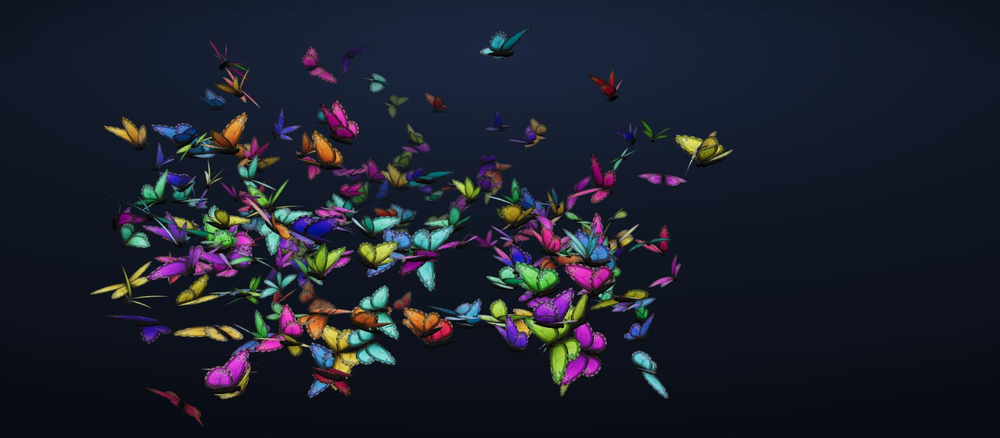
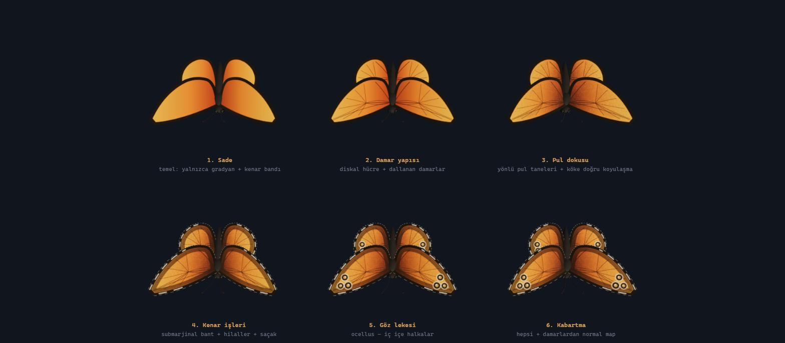
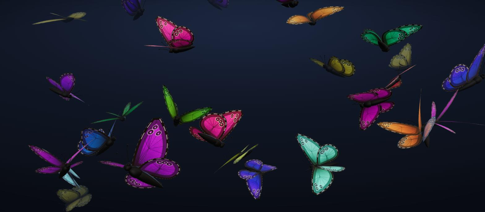

<div align="center">

# 🦋 Butterfly Swarm

**Hundreds of butterflies. One cursor. Two draw calls.**

An interactive butterfly swarm built with Three.js — they chase the mouse,
flee from it, or ignore it entirely. Wing flapping runs on the GPU, flight is
driven by noise, and every butterfly gets its own colour and size.

[](https://threejs.org)
[](https://vite.dev)
[](LICENSE)




</div>

---

## ⚡ Quick start

```bash
npm install
npm run dev          # → http://localhost:5173
```

| Command | What it does |
|---|---|
| `npm run dev` | Development server |
| `npm run build` | Production build → `dist/` |
| `npm run preview` | Serve the build locally |

---

## 🎮 Controls

<table>
<tr><td><b>Move the mouse</b></td><td>Butterflies chase it or scatter</td></tr>
<tr><td><b>Sweep it quickly</b></td><td>The swarm stirs like moving air</td></tr>
<tr><td><b>Drag</b></td><td>Orbit the camera</td></tr>
<tr><td><b>Scroll</b></td><td>Zoom in and out</td></tr>
</table>

The panel on the right has presets — *Sakin* (calm), *Disiplinli Sürü*
(disciplined), *Dağınık* (scattered), *Kaos* — or you can reach for the
individual knobs: count, size and colour variation, follow and flee speeds,
scatter, wing shape, wing pattern, flapping, fog and lighting. Settings persist
in the browser.

> **Note** — the in-app UI and the source comments are in Turkish.

---

## 🔬 Wing detail lab

`/lab.html` — static butterflies side by side, detail increasing left to right,
so you can see what each layer actually contributes in isolation.



The swarm's pattern was chosen here: branching veins with a discal cell,
directional scale texture, a submarginal band, separated lunules, a fringe,
eyespots, and a normal map generated from the veins.



---

## 🧠 How it works

### The whole swarm is 2 draw calls

Body plus eyes, and the four wings, collapse into two merged geometries, both
drawn as `InstancedMesh`. Agent state lives in flat `Float32Array`s rather than
objects — five hundred agents each allocating a few vectors per frame meant
tens of thousands of short-lived objects per second.

### Wing flapping lives in the vertex shader

An instance matrix can carry position, orientation and scale, but not a wing
angle. So each vertex knows which wing it belongs to, and each instance carries
its own phase and speed. The flap maths sits in `butterfly/flap.js` as pure JS
and in `swarm/wingShader.js` as its direct GLSL counterpart.

The stroke is deliberately **not** a sine wave: the downstroke takes 42% of the
cycle and the upstroke 58%. Make it symmetric and the animation picks up that
mechanical windscreen-wiper feel.

### Colour variation by hue rotation

`InstancedMesh.setColorAt()` **multiplies** the diffuse — multiplying an orange
pattern by blue gives muddy darkness, not blue, because the pattern has almost
no blue channel to scale. Colour is instead rotated through HSV in the fragment
shader, which preserves the wing's own gradient and its dark margin band while
leaving the whole colour wheel available.

### The flight volume is the camera frustum

Rather than a fixed world-space box, the swarm is bounded by what's visible.
Zooming, orbiting and window resizing are all accounted for automatically, and
the butterflies always stay on screen.

### Wander driven by simplex noise

An independent random number each frame makes a butterfly jitter. With noise,
the change of direction is **itself continuous**, so the path is unpredictable
without looking panicked.

### A cloud, not a pile

A plain "go to the target" force collapses the swarm into a single blob on the
cursor. The force aims at a **ring** instead, and each butterfly draws its own
radius through `cbrt(random)` so density spreads evenly through the volume —
producing a cloud rather than a shell.

---

## 📊 Performance

| Butterflies | CPU / frame | Triangles | Draw calls |
|--:|--:|--:|--:|
| 120 | 0.95 ms | 152 K | 2 |
| 500 | 1.29 ms | 635 K | 2 |
| 800 | 2.41 ms | 1.02 M | 2 |

Against a 16.7 ms frame budget. Count scales down automatically on small
screens, and the scene calms itself when `prefers-reduced-motion` is set.

---

## 🗂️ Structure

```
src/
├─ butterfly/     silhouettes, body, pattern, flap maths
├─ swarm/         InstancedMesh, geometry merging, shader injection
├─ flight/        steering forces (stateless, allocation-free)
├─ input/         mouse → world target
├─ lab/           wing detail lab
└─ ui/            panel, presets, localStorage
```

---

## 📄 License

[MIT](LICENSE)
